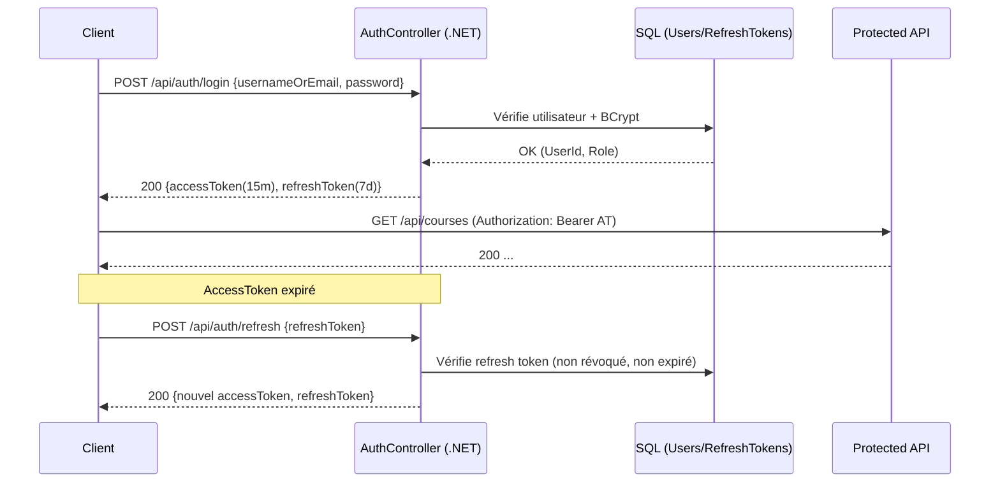
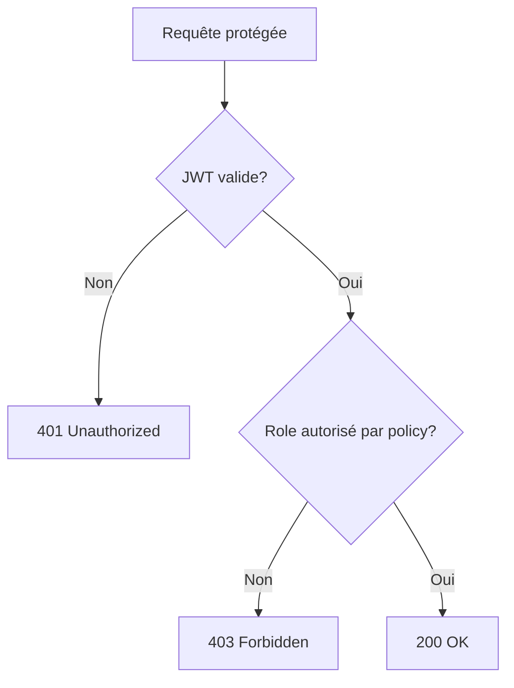
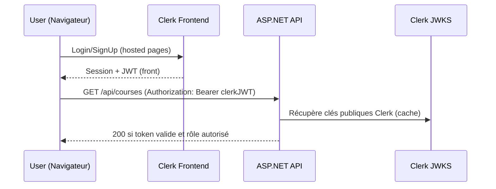
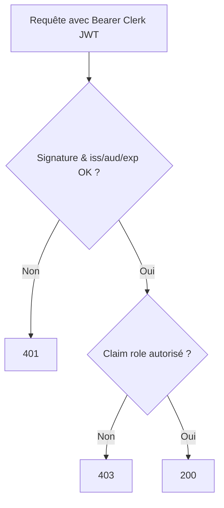
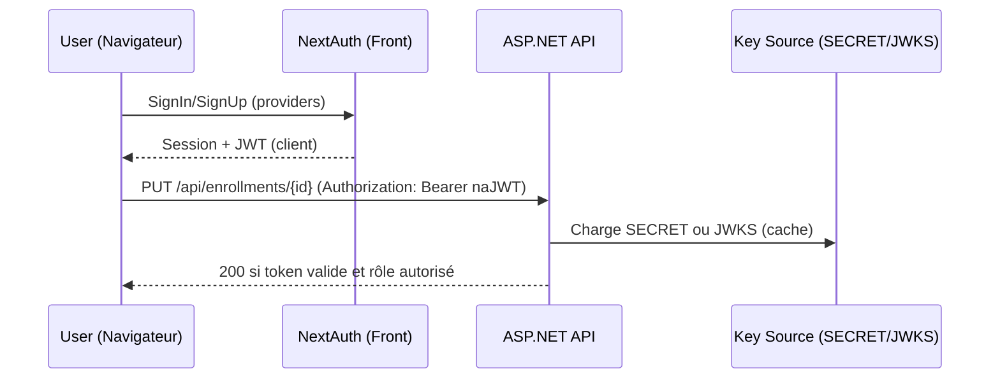
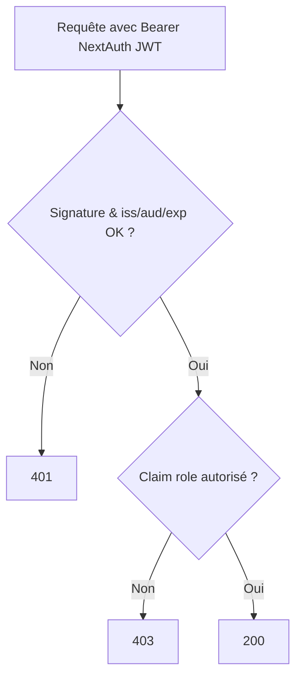
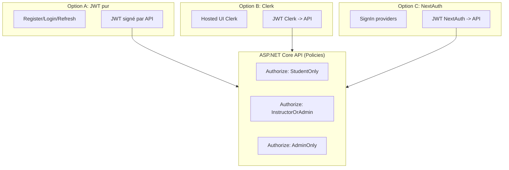

Parfait. Voici la **Phase 3** rédigée pour offrir **trois options d’authentification** au choix (JWT pur côté ASP.NET Core, Clerk hébergé, ou NextAuth côté front).
J’ai rendu la section **exhaustive** : endpoints, rôles, en-têtes, schémas d’E/S, erreurs, configuration côté API, et **diagrammes Mermaid** (flux + séquences).

> Remarque : en **Phase 3**, seuls les endpoints d’auth diffèrent selon l’option. Les endpoints « métier » (Courses, Instructors, Students, Enrollments) restent identiques mais deviennent **protégés** selon les rôles/policies.

---

# Phase 3 — Authentification & Autorisation (trois options au choix)

## Rôles et policies (communs aux 3 options)

* **Rôles** : `Student`, `Instructor`, `Admin`
* **Policies** :

  * `StudentOnly` → `RequireRole("Student")`
  * `InstructorOrAdmin` → `RequireRole("Instructor","Admin")`
  * `AdminOnly` → `RequireRole("Admin")`

### Exigences d’accès (exhaustif)

| Ressource               | Méthode           | Accès requis                                  |
| ----------------------- | ----------------- | --------------------------------------------- |
| `/api/courses`          | GET (liste, id)   | Tous utilisateurs **autorisés** (auth requis) |
| `/api/courses`          | POST, PUT         | `InstructorOrAdmin`                           |
| `/api/courses/{id}`     | DELETE            | `AdminOnly`                                   |
| `/api/instructors`      | GET (liste, id)   | Tous utilisateurs autorisés                   |
| `/api/instructors`      | POST, PUT, DELETE | `AdminOnly`                                   |
| `/api/students`         | GET (liste, id)   | Tous utilisateurs autorisés                   |
| `/api/students`         | POST              | `InstructorOrAdmin`                           |
| `/api/students/{id}`    | PUT, DELETE       | `AdminOnly`                                   |
| `/api/enrollments`      | GET (liste, id)   | Tous **authentifiés**                         |
| `/api/enrollments`      | POST              | Tous **authentifiés**                         |
| `/api/enrollments/{id}` | PUT               | `InstructorOrAdmin`                           |
| `/api/enrollments/{id}` | DELETE            | `AdminOnly`                                   |

> « Tous utilisateurs autorisés » = **authentifiés** (peu importe le rôle). Les 401/403 doivent être renvoyés correctement.

---

## Option A — **JWT pur** (ASP.NET Core)

### Vue d’ensemble

* L’API gère **Register**, **Login**, **Refresh**, **Logout/Revoke**, **Validate**, **Me**.
* **Access token (JWT)** court (ex. 15 minutes) + **Refresh token** long (ex. 7 jours).
* **BCrypt** pour le hachage des mots de passe.
* **Claims** JWT : `sub` (UserId), `unique_name` (Username), `role`, `email`, `iat`, `exp`.

### Endpoints d’auth (exhaustif)

Préfixe commun : `/api/auth`

| Endpoint    | Méthode | Corps requête                                        | Réponse (200)                                                      | Erreurs                                        |
| ----------- | ------- | ---------------------------------------------------- | ------------------------------------------------------------------ | ---------------------------------------------- |
| `/register` | POST    | `{ username, email, password, firstName, lastName }` | `{ userId, username, email, role }`                                | 400 (validation), 409 (conflit email/username) |
| `/login`    | POST    | `{ usernameOrEmail, password }`                      | `{ accessToken, refreshToken, tokenType:"Bearer", expiresIn:900 }` | 400 (validation), 401 (invalid creds)          |
| `/refresh`  | POST    | `{ refreshToken }`                                   | `{ accessToken, refreshToken, tokenType, expiresIn }`              | 400, 401 (invalid/expired), 409 (revoked)      |
| `/logout`   | POST    | `–` (Header: Bearer access)                          | `{ success:true }`                                                 | 401 (non authentifié)                          |
| `/revoke`   | POST    | `{ refreshToken }`                                   | `{ success:true }`                                                 | 400, 404                                       |
| `/validate` | POST    | `–` (Header: Bearer access)                          | `{ valid:true, sub, username, role, exp }`                         | 401 (invalid)                                  |
| `/me`       | GET     | `–` (Header: Bearer access)                          | `{ id, username, email, role, firstName, lastName }`               | 401                                            |

**En-têtes** : `Authorization: Bearer <accessToken>`

**Schémas de réponse type**

```json
// Login / Refresh (200)
{
  "accessToken": "eyJhbGciOiJIUzI1NiIsInR5cCI6...",
  "refreshToken": "6f0e6ab2-...",
  "tokenType": "Bearer",
  "expiresIn": 900
}
```

### Configuration .NET (extrait)

* `Microsoft.AspNetCore.Authentication.JwtBearer`
* `TokenValidationParameters` : `ValidateIssuer=true`, `ValidateAudience=true`, `ValidateLifetime=true`, `ValidateIssuerSigningKey=true`
* `Issuer` = `EduTrackAPI`, `Audience` = `EduTrackClients`, clé HMAC 256 bits

### Séquences (Mermaid)

**Flux login + usage API + refresh**



**Décision d’autorisation**



---

## Option B — **Clerk** (front géré par Clerk, backend en validation JWT)

### Vue d’ensemble

* **Inscription/Connexion** via **Clerk** (hébergé).
* Le front récupère un **JWT** (ou session) depuis Clerk et l’envoie à l’API (`Authorization: Bearer <token>`).
* L’API **ne gère pas** `/register` ni `/login`; elle **valide** le token via **JWKS** de Clerk.
* Les **rôles** sont gérés via **public_metadata**/`custom claims`.
* Option : **webhook Clerk** pour synchroniser les utilisateurs vers votre base.

### Endpoints d’auth (côté API) — *exhaustif côté backend*

| Endpoint              | Méthode | Description                                                                                   |
| --------------------- | ------- | --------------------------------------------------------------------------------------------- |
| `/api/auth/validate`  | POST    | Valide le JWT Clerk (via JWKS), retourne les claims utiles `{ valid, sub, email, role }`      |
| `/api/auth/me`        | GET     | Retourne le profil mappé depuis les claims Clerk (UserId, email, role)                        |
| `/api/webhooks/clerk` | POST    | (Facultatif) Réception des évènements Clerk (user.created, user.updated) pour synchronisation |

> **Pas** de `/register`/`/login` côté API. Ces flux se font via **Clerk** (hébergé/front).

**En-têtes** : `Authorization: Bearer <clerk_jwt>`

**Validation côté API** :

* Récupérer la **clé publique** via **JWKS** de Clerk et **valider** la signature + `iss`, `aud`, `exp`.
* Extraire `sub`, `email`, `role` (depuis `public_metadata.role` par ex.), mapper vers vos `ClaimsPrincipal`.

### Séquences (Mermaid)

**Flux Clerk (front) → API protégée**



**Décision d’autorisation (Clerk)**



---

## Option C — **NextAuth** (front Next.js, backend ASP.NET en validation JWT)

### Vue d’ensemble

* **Sign-in/Sign-up** gérés par **NextAuth** côté front.
* Configurer NextAuth pour **émettre un JWT** (ou expose **JWKS**).
* Le front appelle l’API ASP.NET avec `Authorization: Bearer <nextauth_jwt>`.
* L’API **valide** la signature en important la clé/secret ou via JWKS (si exposé).
* Les rôles sont encodés dans le **payload JWT** (ex : `role: "Instructor"`).
* Option : **endpoint d’échange** côté front si vous préférez transformer le cookie de session en JWT API.

### Endpoints d’auth (côté API) — *exhaustif côté backend*

| Endpoint             | Méthode | Description                                                                      |
| -------------------- | ------- | -------------------------------------------------------------------------------- |
| `/api/auth/validate` | POST    | Valide le JWT NextAuth (clé/secret/JWKS), retourne `{ valid, sub, email, role }` |
| `/api/auth/me`       | GET     | Retourne l’utilisateur courant selon claims NextAuth                             |

> Comme pour Clerk, **pas** de `/register`/`/login` côté API. Ces flux vivent côté **NextAuth**.

**En-têtes** : `Authorization: Bearer <nextauth_jwt>`

**Validation côté API** :

* Configurer `JwtBearer` pour valider la signature du **JWT émis par NextAuth** (HS256 avec SECRET commun, ou RS256 via JWKS).
* Vérifier `iss`, `aud`, `exp` selon votre config NextAuth.

### Séquences (Mermaid)

**Flux NextAuth (front) → API protégée**



**Décision d’autorisation (NextAuth)**



---

## Récapitulatif des endpoints d’auth selon l’option

| Endpoint                   | JWT pur (API)  | Clerk (API)           | NextAuth (API)           |
| -------------------------- | -------------- | --------------------- | ------------------------ |
| `POST /api/auth/register`  | ✔️             | ✖️ (Clerk gère)       | ✖️ (NextAuth gère)       |
| `POST /api/auth/login`     | ✔️             | ✖️                    | ✖️                       |
| `POST /api/auth/refresh`   | ✔️             | ✖️                    | ✖️                       |
| `POST /api/auth/logout`    | ✔️             | ✖️                    | ✖️                       |
| `POST /api/auth/revoke`    | ✔️             | ✖️                    | ✖️                       |
| `POST /api/auth/validate`  | ✔️ (valide AT) | ✔️ (valide Clerk JWT) | ✔️ (valide NextAuth JWT) |
| `GET /api/auth/me`         | ✔️             | ✔️                    | ✔️                       |
| `POST /api/webhooks/clerk` | ✖️             | ✔️ (optionnel)        | ✖️                       |

> **Clerk/NextAuth** : tout le **parcours utilisateur** (register/login/mot de passe, MFA, OAuth providers) est **délégué** au fournisseur. L’API ASP.NET ne fait que **valider** le token reçu.

---

## Exigences de sécurité & erreurs (communes)

* **En-têtes** : `Authorization: Bearer <token>` obligatoires pour endpoints protégés.
* **401 Unauthorized** : token manquant/invalide/expiré.
* **403 Forbidden** : token valide mais rôle non autorisé par la policy.
* **Norme de réponse erreur** (exemple) :

```json
{
  "traceId": "00-9f1b8e...-01",
  "status": 403,
  "error": "Forbidden",
  "message": "Access denied for role Student on /api/courses (DELETE)."
}
```

* **CORS** : autoriser l’origine du front (React/Next).
* **Horodatage** : utiliser UTC pour `CreatedAt`, `EnrollmentDate`, `HireDate`.
* **Caching JWKS** (Clerk/NextAuth RS256) : **obligatoire** pour éviter les latences.

---

## Tests Swagger — Auth

* Activer **JWT Bearer** dans Swagger (`AddSecurityDefinition/Requirement`) pour injecter `Authorization: Bearer`.
* **JWT pur** : tester `/register`, `/login`, récupérer l’`accessToken`, puis tester les endpoints protégés.
* **Clerk/NextAuth** : coller un **token réel** (récupéré côté front) dans Swagger (Authorize → Bearer).
* Tester 401 (token invalide/absent) et 403 (rôle insuffisant) pour chaque ressource protégée.

---

## Choisir l’option

* **Besoin 100% back, indépendant du front** → **JWT pur** (.NET)
* **Vous avez un front Next.js et voulez externaliser identité + UI auth** → **Clerk**
* **Vous avez déjà Next.js et voulez centraliser auth via NextAuth** → **NextAuth** (avec JWT émis côté front, validé par l’API)

---

## Annexes — Extraits de configuration

### A) JWT pur — Program.cs (exemple compressé)

```csharp
builder.Services.AddAuthentication("Bearer")
  .AddJwtBearer("Bearer", opts =>
  {
      opts.TokenValidationParameters = new TokenValidationParameters
      {
          ValidateIssuer = true,
          ValidateAudience = true,
          ValidateLifetime = true,
          ValidateIssuerSigningKey = true,
          ValidIssuer = builder.Configuration["Jwt:Issuer"],
          ValidAudience = builder.Configuration["Jwt:Audience"],
          IssuerSigningKey = new SymmetricSecurityKey(
              Encoding.UTF8.GetBytes(builder.Configuration["Jwt:Key"]!))
      };
  });

builder.Services.AddAuthorization(options =>
{
    options.AddPolicy("StudentOnly", p => p.RequireRole("Student"));
    options.AddPolicy("InstructorOrAdmin", p => p.RequireRole("Instructor","Admin"));
    options.AddPolicy("AdminOnly", p => p.RequireRole("Admin"));
});
```

### B) Clerk / C) NextAuth — Validation via JWKS (RS256) ou SECRET (HS256)

```csharp
builder.Services.AddAuthentication(JwtBearerDefaults.AuthenticationScheme)
  .AddJwtBearer(options =>
  {
      options.MetadataAddress = "{JWKS_OR_OIDC_DISCOVERY_URL}";
      options.TokenValidationParameters = new TokenValidationParameters
      {
          ValidateIssuer = true,
          ValidIssuer = "{expected_issuer}",
          ValidateAudience = true,
          ValidAudience = "{expected_audience}",
          ValidateLifetime = true,
          ValidateIssuerSigningKey = true
      };
  });
```

> Remplacer les placeholders par les valeurs **Clerk** ou **NextAuth**.
> Si **HS256** (NextAuth SECRET partagé), utiliser `IssuerSigningKey = new SymmetricSecurityKey(Encoding.UTF8.GetBytes(SECRET))` et désactiver `MetadataAddress`.

---

## Diagramme global (comparatif des 3 choix)




