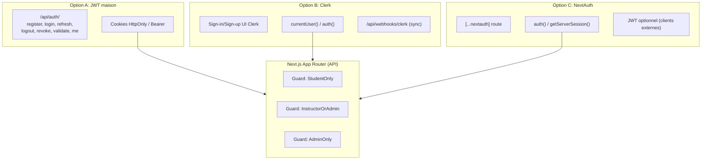
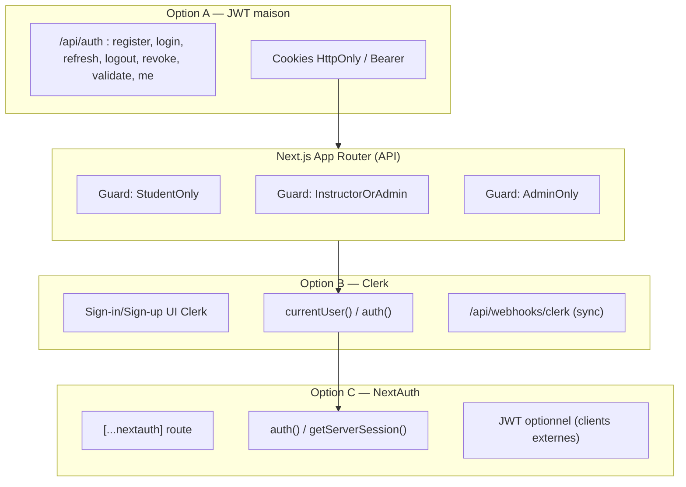

# Phase 3 — Authentification & Autorisation dans Next.js (trois options)

<ul>
  <li><a href="#sec-phase3">Phase 3 — Authentification & Autorisation dans Next.js (trois options)</a></li>
  <li><a href="#sec-intro">1 – Introduction</a></li>
  <li><a href="#sec-who">Table récapitulative — Qui peut faire quoi</a></li>
  <li><a href="#sec-roles">2 – Rôles et contrôle d’accès</a></li>
  <li><a href="#sec-guard-structure">3 – Structure de protection (guards / middleware)</a></li>

  <li>
    <a href="#sec-opt-a">4 – Option A — JWT “maison” dans Next.js</a>
    <ul>
      <li><a href="#sec-opt-a-overview">4.1 Vue d’ensemble</a></li>
      <li><a href="#sec-opt-a-deps">4.2 Dépendances</a></li>
      <li><a href="#sec-opt-a-prisma">4.3 Modèle Prisma minimal</a></li>
      <li><a href="#sec-opt-a-endpoints">4.4 Endpoints d’auth</a></li>
      <li><a href="#sec-opt-a-cookies">4.5 Cookies recommandés</a></li>
      <li><a href="#sec-opt-a-login-example">4.6 Exemple /login (signature + cookies)</a></li>
      <li><a href="#sec-opt-a-guard">4.7 Guard d’accès (handler métier)</a></li>
      <li><a href="#sec-opt-a-seq">4.8 Séquences (Mermaid)</a></li>
      <li><a href="#sec-opt-a-authz">4.9 Décision d’autorisation</a></li>
    </ul>
  </li>

  <li>
    <a href="#sec-opt-b">5 – Option B — Clerk pour Next.js</a>
    <ul>
      <li><a href="#sec-opt-b-overview">5.1 Vue d’ensemble</a></li>
      <li><a href="#sec-opt-b-deps">5.2 Dépendances</a></li>
      <li><a href="#sec-opt-b-mw">5.3 Middleware Clerk</a></li>
      <li><a href="#sec-opt-b-validate">5.4 Validation côté API</a></li>
      <li><a href="#sec-opt-b-endpoints">5.5 Endpoints d’auth côté Next</a></li>
      <li><a href="#sec-opt-b-seq">5.6 Séquences (Mermaid)</a></li>
    </ul>
  </li>

  <li>
    <a href="#sec-opt-c">6 – Option C — NextAuth (JWT ou session)</a>
    <ul>
      <li><a href="#sec-opt-c-overview">6.1 Vue d’ensemble</a></li>
      <li><a href="#sec-opt-c-deps">6.2 Dépendances</a></li>
      <li><a href="#sec-opt-c-route">6.3 Route NextAuth</a></li>
      <li><a href="#sec-opt-c-handlers">6.4 Utilisation dans les handlers API</a></li>
      <li><a href="#sec-opt-c-seq">6.5 Séquences (Mermaid)</a></li>
    </ul>
  </li>

  <li><a href="#sec-recap-endpoints">7 – Récap des endpoints d’auth (par option)</a></li>
  <li><a href="#sec-security">8 – Erreurs & sécurité (communes)</a></li>
  <li><a href="#sec-diagram-global">9 – Diagramme global (comparatif Next)</a></li>
  <li><a href="#sec-diagram-details">9.1 Détails des diagrammes</a></li>
  <li><a href="#sec-choix">10 – Conseils de choix rapide</a></li>
</ul>


## 1 -  Introduction

L’objectif est de sécuriser l’application Next.js en ajoutant une couche d’authentification et d’autorisation sur les endpoints existants. Les accès sont contrôlés par rôles (`Student`, `Instructor`, `Admin`) afin de limiter chaque action (lecture, création, modification, suppression) selon des règles précises. Trois options d’auth sont proposées au choix : **JWT maison**, **Clerk**, ou **NextAuth**, sans changer les routes métier. Des guards/middlewares côté API valident la session/token puis vérifient le rôle avant d’exécuter la logique. Le tout doit renvoyer des réponses cohérentes (401/403), rester testable via Swagger/clients HTTP, et se brancher proprement à Prisma/PostgreSQL.


> Table récapitulative « qui peut faire quoi » (par rôle et par action) :

| Ressource / Action                          | Student | Instructor | Admin |
| ------------------------------------------- | :-----: | :--------: | :---: |
| **Courses – GET (liste / id)**              |   Oui   |     Oui    |  Oui  |
| **Courses – POST (créer)**                  |   Non   |     Oui    |  Oui  |
| **Courses – PUT (modifier)**                |   Non   |     Oui    |  Oui  |
| **Courses – DELETE (supprimer)**            |   Non   |     Non    |  Oui  |
| **Instructors – GET (liste / id)**          |   Oui   |     Oui    |  Oui  |
| **Instructors – POST (créer)**              |   Non   |     Non    |  Oui  |
| **Instructors – PUT (modifier)**            |   Non   |     Non    |  Oui  |
| **Instructors – DELETE (supprimer)**        |   Non   |     Non    |  Oui  |
| **Students – GET (liste / id)**             |   Oui   |     Oui    |  Oui  |
| **Students – POST (créer)**                 |   Non   |     Oui    |  Oui  |
| **Students – PUT (modifier)**               |   Non   |     Non    |  Oui  |
| **Students – DELETE (supprimer)**           |   Non   |     Non    |  Oui  |
| **Enrollments – GET (liste / id)**          |   Oui   |     Oui    |  Oui  |
| **Enrollments – POST (créer / s’inscrire)** |   Oui   |     Oui    |  Oui  |
| **Enrollments – PUT (modifier / noter)**    |   Non   |     Oui    |  Oui  |
| **Enrollments – DELETE (supprimer)**        |   Non   |     Non    |  Oui  |

**Rappels :**

* « Oui » implique que l’utilisateur doit être authentifié.
* **401** si non authentifié, **403** si authentifié mais rôle insuffisant.


## 2 - Rôles et contrôle d’accès (communs aux 3 options)

* **Rôles** : `Student`, `Instructor`, `Admin` (stockés en base via Prisma, ou portés en claims/jwt selon l’option).
* **Matrice d’accès** identique à ce qui a été défini (les endpoints “métier” restent les mêmes; ils deviennent protégés) :

| Ressource               | Méthode           | Accès requis                      |
| ----------------------- | ----------------- | --------------------------------- |
| `/api/courses`          | GET (liste, id)   | Authentifié (peu importe le rôle) |
| `/api/courses`          | POST, PUT         | `Instructor` ou `Admin`           |
| `/api/courses/{id}`     | DELETE            | `Admin`                           |
| `/api/instructors`      | GET (liste, id)   | Authentifié                       |
| `/api/instructors`      | POST, PUT, DELETE | `Admin`                           |
| `/api/students`         | GET (liste, id)   | Authentifié                       |
| `/api/students`         | POST              | `Instructor` ou `Admin`           |
| `/api/students/{id}`    | PUT, DELETE       | `Admin`                           |
| `/api/enrollments`      | GET (liste, id)   | Authentifié                       |
| `/api/enrollments`      | POST              | Authentifié                       |
| `/api/enrollments/{id}` | PUT               | `Instructor` ou `Admin`           |
| `/api/enrollments/{id}` | DELETE            | `Admin`                           |

> “Authentifié” = session valide (selon l’option). Répondre **401** si non authentifié, **403** si rôle insuffisant.


## 3 - Structure de protection (commune, adaptée par option)

* **Guard de route API** (par ressource) : dans chaque handler Next (ex. `app/api/courses/route.ts`), extraire l’identité (JWT/Clerk/NextAuth), **valider la session**, puis **vérifier le rôle** avant d’exécuter.
* **middleware.ts** (optionnel) : pour rejeter très tôt les requêtes non authentifiées sur des chemins sensibles, ou pour enrichir les headers côté serveur. Utile mais non obligatoire (les guards dans les handlers suffisent).


## 4 - Option A — JWT “maison” dans Next.js

### Vue d’ensemble

* Vous exposez **vos propres endpoints** d’auth Next (App Router) et gérez les **tokens** vous-même :

  * **Access Token** (court, ex. 15 min) en **cookie HttpOnly** (recommandé) ou en `Authorization: Bearer`
  * **Refresh Token** (long, ex. 7 jours) en **cookie HttpOnly** distinct
* Hash des mots de passe : **bcryptjs**.
* Sign JWT : **jose** (ou `jsonwebtoken`).
* Persistance utilisateurs/refresh tokens : **Prisma**.

### Dépendances

```
npm i bcryptjs jose zod
```

### Modèle Prisma minimal

* `User` (avec `role`)
* `RefreshToken` (token, userId, expiresAt, revokedAt)

### Endpoints d’auth (exhaustifs, sous `/app/api/auth/...`)

> Préfixe commun : `/api/auth`

| Endpoint    | Méthode | Requête (JSON)                                       | Réponse (200)                                             | Notes                                |
| ----------- | ------- | ---------------------------------------------------- | --------------------------------------------------------- | ------------------------------------ |
| `/register` | POST    | `{ username, email, password, firstName, lastName }` | `{ userId, username, email, role }`                       | 400 validation, 409 conflit          |
| `/login`    | POST    | `{ usernameOrEmail, password }`                      | `{ accessToken, expiresIn }` ou vide (si cookie HttpOnly) | place aussi `refreshToken` en cookie |
| `/refresh`  | POST    | — (utilise cookie `refreshToken`)                    | `{ accessToken, expiresIn }`                              | 401/409 si expiré/révoqué            |
| `/logout`   | POST    | —                                                    | `{ success:true }` + clear cookies                        | 401 si non auth                      |
| `/revoke`   | POST    | `{ refreshToken }` (ou prend cookie)                 | `{ success:true }`                                        | admin/self-revoke                    |
| `/validate` | POST    | — (lit access token cookie/Authorization)            | `{ valid, sub, email, role, exp }`                        | 401 si invalide                      |
| `/me`       | GET     | —                                                    | `{ id, username, email, role, firstName, lastName }`      | 401 si non auth                      |

**Cookies recommandés**

* `access_token` : HttpOnly, Secure, SameSite=Lax, `Max-Age=900`
* `refresh_token` : HttpOnly, Secure, SameSite=Strict, `Max-Age=604800`

**Exemple — signature et set-cookie (route `/login`)**

```ts
// app/api/auth/login/route.ts
import { NextResponse } from 'next/server'
import { prisma } from '@/lib/prisma'
import bcrypt from 'bcryptjs'
import { SignJWT } from 'jose'

const key = new TextEncoder().encode(process.env.JWT_SECRET!)
const ISSUER = 'EduTrackNext'
const AUDIENCE = 'EduTrackClients'

export async function POST(req: Request) {
  const { usernameOrEmail, password } = await req.json()

  const user = await prisma.user.findFirst({
    where: { OR: [{ email: usernameOrEmail }, { username: usernameOrEmail }] }
  })
  if (!user || !(await bcrypt.compare(password, user.passwordHash))) {
    return NextResponse.json({ error: 'Invalid credentials' }, { status: 401 })
  }

  const accessToken = await new SignJWT({
    sub: user.id,
    email: user.email,
    role: user.role
  })
    .setProtectedHeader({ alg: 'HS256' })
    .setIssuer(ISSUER)
    .setAudience(AUDIENCE)
    .setIssuedAt()
    .setExpirationTime('15m')
    .sign(key)

  // Générer & persister refreshToken (opaque UUID) puis cookie
  const res = NextResponse.json({ accessToken, expiresIn: 900 })
  res.cookies.set('access_token', accessToken, { httpOnly: true, secure: true, sameSite: 'lax', maxAge: 900, path: '/' })
  // set refresh_token aussi...
  return res
}
```

**Guard d’accès (exemple dans un handler “métier”)**

```ts
// app/api/courses/route.ts (GET public-auth; POST require Instructor/Admin)
import { NextResponse } from 'next/server'
import { getUserFromRequest } from '@/lib/auth/jwt' // lit cookie ou header et vérifie le token

export async function GET() {
  const user = await getUserFromRequest() // 401 si absent/invalid
  // ... retourner la liste
  return NextResponse.json([])
}

export async function POST(req: Request) {
  const user = await getUserFromRequest()
  if (!['Instructor', 'Admin'].includes(user.role)) {
    return NextResponse.json({ error: 'Forbidden' }, { status: 403 })
  }
  // ... créer le cours
  return NextResponse.json({ ok: true }, { status: 201 })
}
```

**Séquences (Mermaid) — Login → API → Refresh**


**Décision d’autorisation**


## 5 - Option B — Clerk pour Next.js

### Vue d’ensemble

* **Clerk** gère l’UI (Sign in/Sign up), MFA, providers.
* Dans l’API Next, on valide via le **SDK Clerk** (aucune route /login à coder).
* Les rôles peuvent être stockés dans **`publicMetadata.role`** chez Clerk et/ou synchronisés en base via **webhook**.

### Dépendances

```
npm i @clerk/nextjs
```

### Middleware Clerk

* `middleware.ts` (via `clerkMiddleware`) pour protéger des chemins par défaut (facultatif si vous gardez les guards dans les handlers).
* Exemple minimal :

```ts
// middleware.ts
import { clerkMiddleware } from '@clerk/nextjs/server'
export default clerkMiddleware()
export const config = { matcher: ['/((?!_next|.*\\..*).*)'] }
```

### Validation côté API (handlers)

* Dans vos routes App Router :

```ts
// app/api/courses/route.ts
import { auth, currentUser } from '@clerk/nextjs/server'
import { NextResponse } from 'next/server'

export async function GET() {
  const { userId } = auth() // 401 si absent
  // si besoin: const user = await currentUser(); const role = user?.publicMetadata?.role
  return NextResponse.json([])
}

export async function POST(req: Request) {
  const user = await currentUser()
  const role = user?.publicMetadata?.role
  if (role !== 'Instructor' && role !== 'Admin') {
    return NextResponse.json({ error: 'Forbidden' }, { status: 403 })
  }
  // créer le cours...
  return NextResponse.json({ ok: true }, { status: 201 })
}
```

### Endpoints d’auth côté Next (ce que vous exposez)

* **Vous n’exposez pas** `/api/auth/login` ni `/register`.
* Endpoints utiles côté backend :

  * `POST /api/auth/validate` : retourne les claims Clerk validés (utile pour debug/outillage)
  * `GET /api/auth/me` : retourne l’utilisateur courant (id, email, role) via `currentUser()`
  * `POST /api/webhooks/clerk` : **optionnel**, pour synchroniser user/role en base Prisma

### Séquences (Mermaid)


## 6 - Option C — NextAuth (JWT ou session cookie)

### Vue d’ensemble

* **NextAuth** gère les providers (Credentials/OAuth), stocke session (cookie) et peut émettre un **JWT**.
* L’API Next lit la session via **`auth()`/`getServerSession`** dans les handlers ou **valide un JWT** si vous l’activez.

### Dépendances

```
npm i next-auth
```

### Route NextAuth

* App Router : `app/api/auth/[...nextauth]/route.ts` (config providers).
* **JWT mode** (recommandé pour APIs externes) : `session: { strategy: 'jwt' }`, callback `jwt` pour injecter `role`.

**Exemple (extrait)**

```ts
// app/api/auth/[...nextauth]/route.ts
import NextAuth from "next-auth"
import Credentials from "next-auth/providers/credentials"
import { prisma } from "@/lib/prisma"
import bcrypt from "bcryptjs"

const handler = NextAuth({
  session: { strategy: 'jwt' },
  providers: [
    Credentials({
      name: "Credentials",
      credentials: { username: {}, password: {} },
      async authorize(creds) {
        const user = await prisma.user.findFirst({
          where: { OR: [{ email: creds.username }, { username: creds.username }] }
        })
        if (!user) return null
        const ok = await bcrypt.compare(creds.password, user.passwordHash)
        return ok ? { id: user.id, email: user.email, role: user.role } : null
      }
    })
  ],
  callbacks: {
    async jwt({ token, user }) {
      if (user) token.role = (user as any).role
      return token
    },
    async session({ session, token }) {
      if (token) (session as any).role = token.role
      return session
    }
  }
})

export { handler as GET, handler as POST }
```

### Utilisation dans vos handlers API

* **Cookie de session** (même origine) :

```ts
// app/api/enrollments/[id]/route.ts
import { auth } from "next-auth"
import { NextResponse } from "next/server"

export async function PUT(req: Request, { params }: { params: { id: string } }) {
  const session = await auth()
  if (!session) return NextResponse.json({ error: 'Unauthorized' }, { status: 401 })
  const role = (session as any).role
  if (role !== 'Instructor' && role !== 'Admin') {
    return NextResponse.json({ error: 'Forbidden' }, { status: 403 })
  }
  // ... update inscription / note
  return NextResponse.json({ ok: true })
}
```

* **JWT NextAuth** (si vous exposez un token pour clients externes) :

  * Ajoutez un mini-endpoint **`GET /api/auth/token`** qui retourne le JWT de session.
  * Côté API, lisez `Authorization: Bearer <jwt>` et vérifiez via la clé/secret NextAuth.

### Séquences (Mermaid)


## 7 - Récap des endpoints d’auth à exposer selon l’option (côté Next)

| Endpoint                       | JWT “maison” | Clerk            | NextAuth                          |
| ------------------------------ | ------------ | ---------------- | --------------------------------- |
| `POST /api/auth/register`      | ✔︎           | ✖︎ (Clerk UI)    | ✖︎ (NextAuth UI/providers)        |
| `POST /api/auth/login`         | ✔︎           | ✖︎               | ✖︎ (via `[...nextauth]`)          |
| `POST /api/auth/refresh`       | ✔︎           | ✖︎               | ✖︎ (NextAuth gère la session/JWT) |
| `POST /api/auth/logout`        | ✔︎           | ✖︎               | ✖︎ (via `[...nextauth]`)          |
| `POST /api/auth/revoke`        | ✔︎           | ✖︎               | ✖︎                                |
| `POST /api/auth/validate`      | ✔︎           | ✔︎ (vérif Clerk) | ✔︎ (vérif session/JWT NextAuth)   |
| `GET  /api/auth/me`            | ✔︎           | ✔︎               | ✔︎                                |
| `POST /api/webhooks/clerk`     | ✖︎           | ✔︎ (optionnel)   | ✖︎                                |
| `GET  /api/auth/[...nextauth]` | ✖︎           | ✖︎               | ✔︎ (route NextAuth)               |


## 8 - Erreurs & sécurité (communes)

* **401 Unauthorized** : session absente / token invalide / expiré.
* **403 Forbidden** : session valide mais rôle insuffisant.
* **CORS** : autoriser l’origine de votre front si vous servez l’API sur domaine séparé.
* **Cookies** : toujours **HttpOnly + Secure** en prod.
* **Horloges** : manipuler UTC pour les dates.
* **JWKS caching** (Clerk / JWT RS256 NextAuth) recommandé.

**Format d’erreur JSON conseillé**

```json
{
  "status": 403,
  "error": "Forbidden",
  "message": "Access denied for role Student on /api/courses (DELETE)."
}
```


## 9 - Diagramme global (comparatif Next)




### Détails :




## 10 - Conseils de choix rapide

* **Simple, full-stack Next, contrôle total** : **JWT “maison”**
* **Besoin d’une solution d’identité gérée (MFA, UI, providers)** : **Clerk**
* **Déjà en Next avec providers variés, logique côté front** : **NextAuth**

